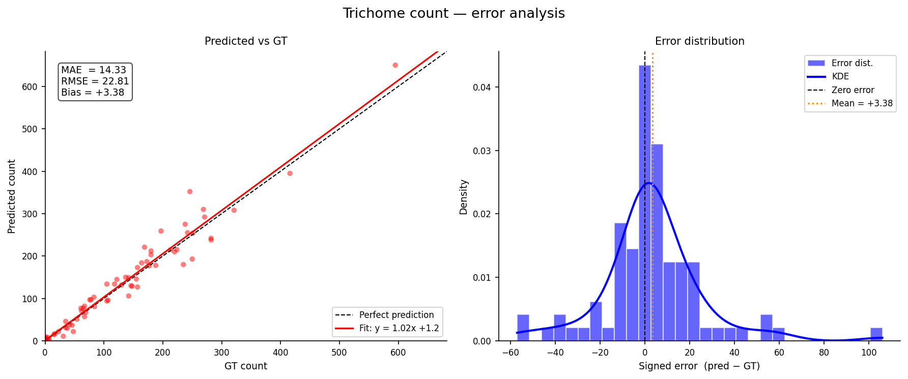
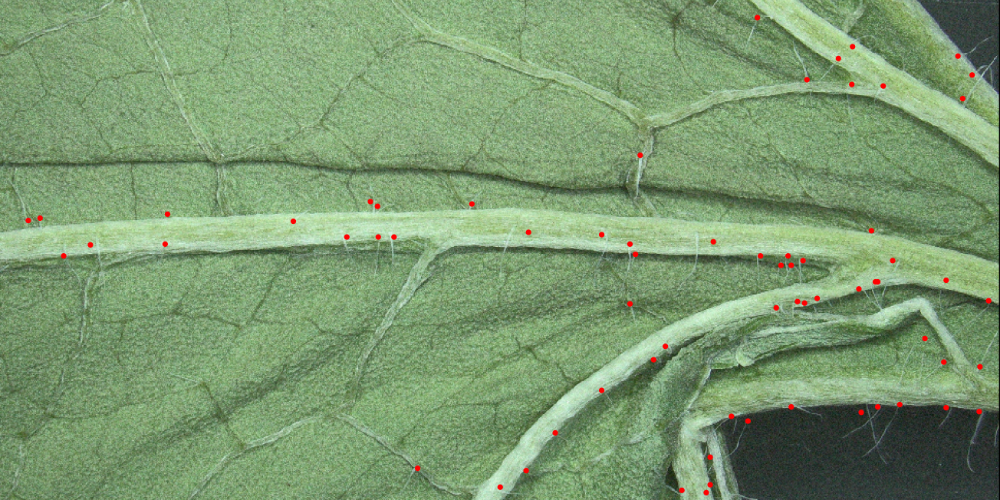
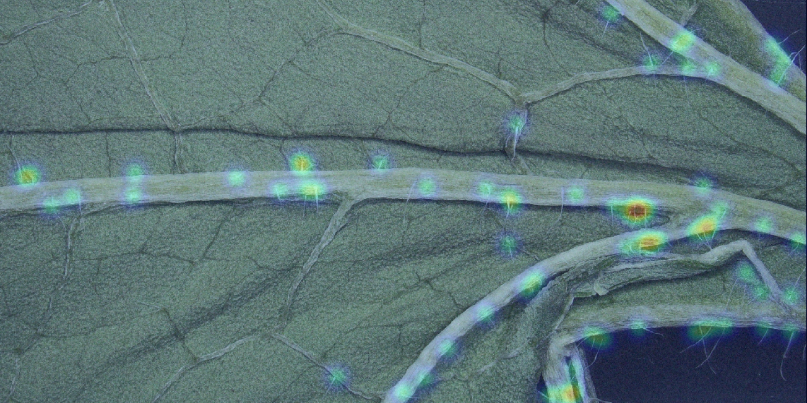
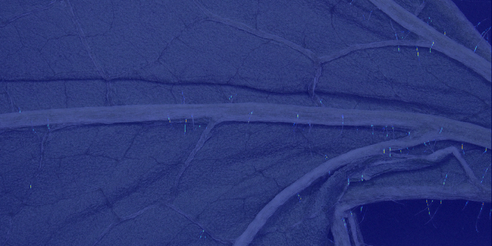

# Trichome Counter

Deep learning pipeline for detecting and counting unbranched leaf trichomes in microscopy images of *Alliaria petiolata* (garlic mustard).

## Overview

The goal of this project is to train a neural network that can reliably detect and count unbranched leaf trichomes from high-resolution leaf images.

The dataset consists of:
- RGB leaf images
- Noisy trichome position annotations generated from manual clicks near trichome locations

Because annotations are sparse and noisy rather than full segmentation masks, the project focuses on robust target generation and density-based learning approaches.

---

## Results

Current best model: `model0_density10` (U-Net, Gaussian density targets, σ=10)

| Metric | Value |
|---|---|
| MAE | 14.33 |
| Mean Error (bias) | +3.38 |
| Pearson r | 0.98 (R² = 0.96) |

### Predicted vs. ground truth count (n=89 test images)



### Example prediction (GT count = 67 | Pred count = 82)

<div style="width:80%; text-align:right;">
    
    <em>Raw sample</em>
</div>


<div style="width:80%; text-align:right;">
    <br>
    
    <em>GT density</em>
</div>


<div style="width:80%; text-align:right;">
    <br>
    
    <em>Predicted density</em>
</div>


---

## Challenges

### 1. High-resolution images with tiny targets

Images have a resolution of `3840×2160`, while trichomes are only a few pixels wide.

This creates a trade-off between:
- preserving trichome visibility
- keeping GPU memory usage manageable

#### Mitigation
- Downscale images carefully while preserving target visibility
- Use ROI extraction / patch-based preprocessing

---

### 2. Noisy annotations

The dataset does not contain semantic segmentation masks.  
Instead, annotations are approximate coordinates obtained from manual clicks near trichomes.

#### Mitigation
- Generate smooth target maps from coordinates
- Experiment with objectives that are robust to localization noise
- Start with short training runs to validate target generation quality

---

## Approach

1. Preprocess images and annotation coordinates
2. Generate target maps suitable for dense prediction
3. Fine-tune a pretrained U-Net
4. Experiment with:
   - loss functions
   - target generation strategies
   - hyperparameters
   - alternative architectures (lower priority)

---

## Project Structure

```text
TrichomeCounter/
│
├── config/
│   └── config.yaml         # Hyperparameter configuration
│
├── data/
│   ├── raw/                # Raw dataset
│   └── processed/       # processed dataset
│       ├── train/
│       ├── val/
│       └── test/
│
├── models/                 # Saved checkpoints
├── outputs/                # Metrics, plots, predictions
│
├── scripts/
│   ├── data_setup.py
│   ├── data_transformations.py
│   ├── data.py
│   ├── engine.py
│   ├── evaluations.py
│   ├── loss.py
│   ├── models.py
│   ├── target_maps.py
│   ├── utils.py
│   └── visualizations.py
│
├── tb_logs/                # Tensorboard event logs
│
├── exploration.ipynb       # Data exploration and experiments
├── requirements.txt
├── train.py                # Training entry point
├── test.py                 # Evaluation entry point
└── README.md
```

---

## Requirements

- Python `3.10.x`

Optional but recommended:
- CUDA-compatible GPU

---

## Installation

### 1. Create virtual environment

```bash
python -m venv venv
```

Activate the environment.

**Linux / macOS**
```bash
source venv/bin/activate
```

**Windows**
```bash
venv\Scripts\activate
```

---

### 2. Install dependencies

```bash
pip install -r requirements.txt
```

---

## Data Preparation

Preprocessing performs:
- dataset splitting
- ROI extraction
- image conversion to `.jpg`
- annotation export to `.npy`

Run preprocessing once before training:

```python
from pathlib import Path
from scripts.data_setup import preprocess_dataset

preprocess_dataset(
    raw_root=Path("data/raw"),
    out_root=Path("data/processed"),
)
```

---

## Training

Train a model using the configuration defined in `config/config.yaml`:

```bash
python -m train
```

Saved artifacts:
- latest checkpoint
- best checkpoint
- training logs

These are stored in:
- `models/`

---

## Evaluation

Evaluate a trained model:

```bash
python -m test --model-name model0_density10
```

Evaluation outputs are written to `outputs/`.

### Available arguments

| Argument | Description |
|---|---|
| `--model-name` | Name of the trained model (required) |
| `--cp` | Checkpoint to evaluate: `last` or `best` |
| `--model-root-dir` | Root directory containing saved models |

Example:

```bash
python -m test \
    --model-name model0_density10 \
    --cp best
```

---

## Model

Current baseline:
- Pretrained U-Net encoder-decoder architecture

The network predicts dense trichome probability / density maps generated from noisy point annotations.

Planned experiments:
- different target map formulations
- counting-based objectives

---

## Future Work

- Improve robustness to annotation noise
- Explore density-estimation approaches
- Maybe: Create small segmentation subset to finetune best model

---

## License

This project is licensed under the MIT License.